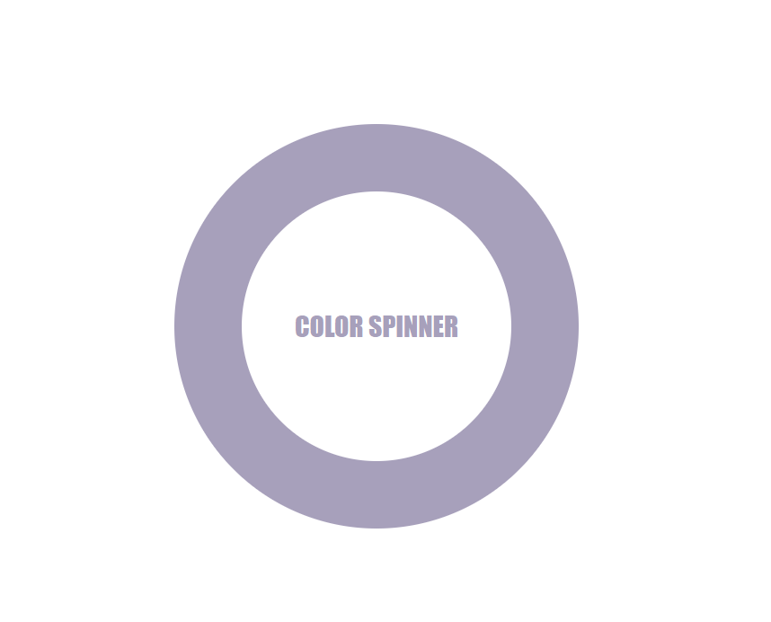

# 🎨 COLOR SPINNER

Welcome to **COLOR SPINNER** – a fun and interactive way to explore color combinations and simple animation effects in HTML, CSS, and JavaScript!

## 🚀 Live Demo

> 💡 https://muzamilalisuleman.github.io/COLOR_SPINNER/

## 🖥️ How to Use

1. Clone or download the repository.
2. Open `colorspinner.html` in your browser.
3. Watch the color spinner animation in action!

## 🌟 Features

- Simple and clean HTML structure
- CSS animations for a spinning effect
- Interactive and visually appealing
- Educational for beginners learning front-end development

## 🖼️ Preview

## 🛠️ Technologies Used

- HTML
- CSS
- JavaScript

## 📚 Learning Goals

This project is great for:

- Practicing basic web development
- Understanding CSS animations
- Exploring interactive front-end design

## 🤝 Contributing

Feel free to fork this repo and submit a pull request if you'd like to contribute!

## 📜 License

This project is open-source and free to use.

---

Made with ❤️ by [MUZAMIL ALI SULEMAN](https://github.com/MUZAMILALISULEMAN)

